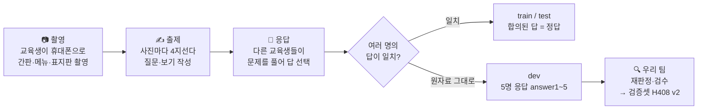
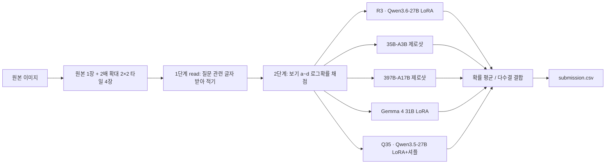
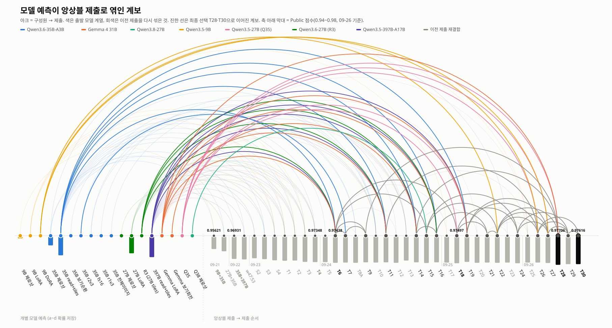
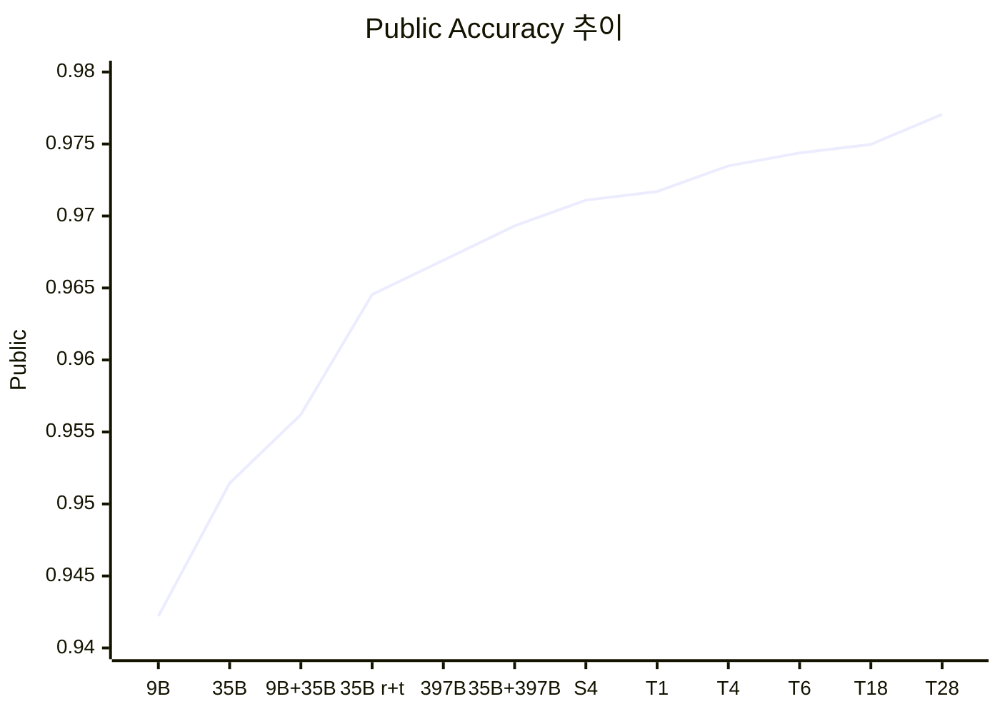
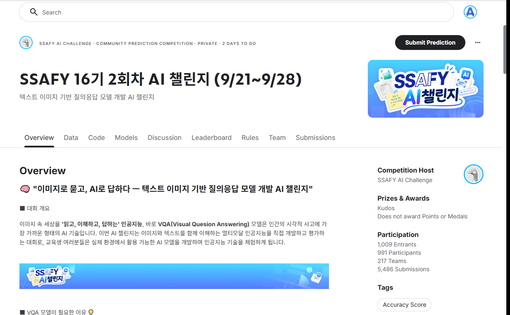
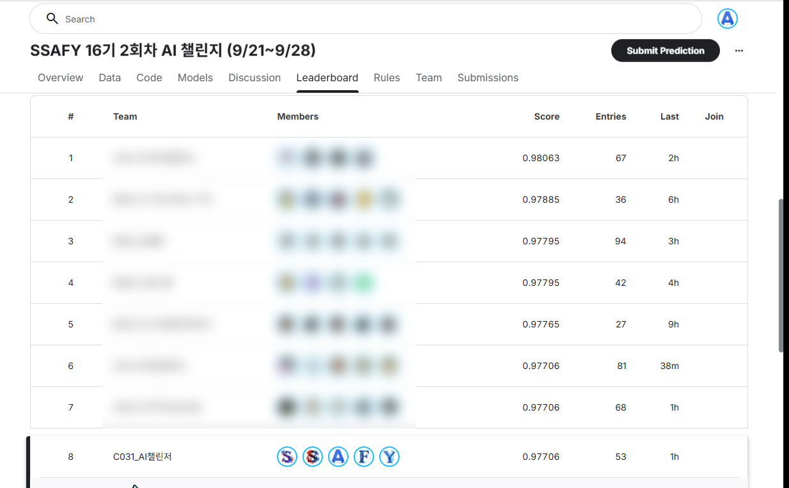
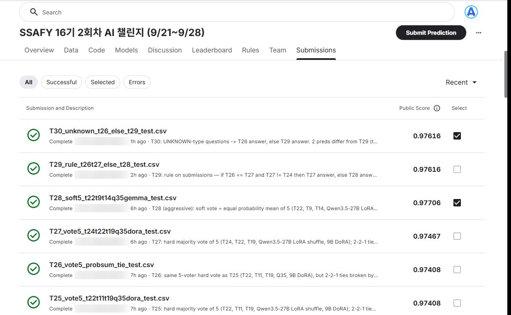
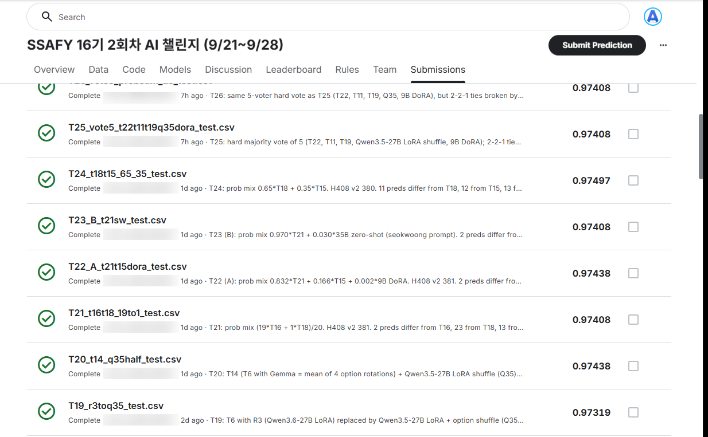
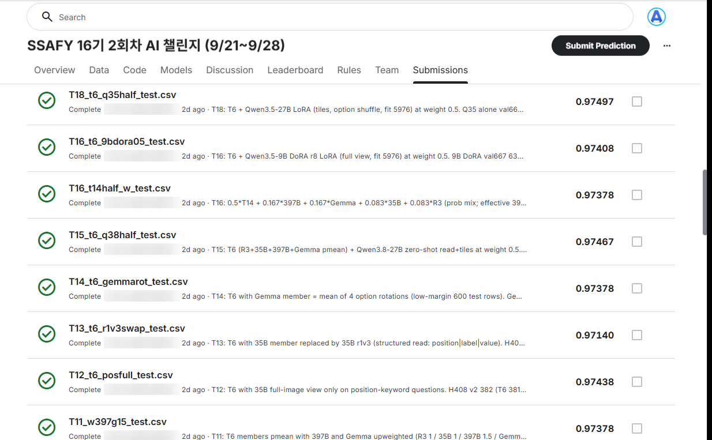

# SSAFY 16기 2차 AI 챌린지 — Real-world Scene Text VQA

**팀 C031_AI챌린저** · 김진영 · 윤석웅 · 박건순 · 김현호 · 김민우


-20BEFF?logo=kaggle&logoColor=white)


> ⏳ **대회 진행 중에 쓴 문서다.** Public 점수·순위는 2026-09-26 기준 중간 기록이다. 최종 점수(Private)와 최종 순위는 대회 종료 후 [⏳ 대회 종료 후 갱신할 항목](#-대회-종료-후-갱신할-항목)에 따라 바꿔 넣는다.

---

## 📌 프로젝트 개요

교육생이 휴대폰으로 찍은 **실사진 속 글자**를 읽고 **4지선다** 질문에 답하는 멀티모달 VQA 대회다.
글자가 아주 작고, 한글·영어·숫자·외국어가 섞여 있으며, 조명·반사·기울어짐이 있고, 읽은 뒤 선택·추론까지 해야 하는 문항이 많다.

사전 배포 베이스라인은 `Qwen2.5-VL-3B-Instruct`였다. 우리 팀은 공개 모델 사용이 허용된다는 규칙을 활용해
**Qwen3.5 / 3.6 계열(9B ~ 397B)과 Gemma 4 31B**를 비교했다. 최종 제출은 **여러 모델의 a~d 확률을 결합한 앙상블**로 만들었다.

| 항목 | 내용 |
|---|---|
| 데이터 | train 6,714 / dev 2,683 / test 6,714장 (이미지 대부분 720×960) |
| 데이터 출처 | **SSAFY 교육생(우리 팀 포함)이 직접 촬영하고, 문제를 만들고, 서로 풀어 라벨을 붙인 사진** |
| 입력 → 출력 | 이미지 + 질문 + 보기 a~d → 정답 글자 1개 |
| dev 특징 | 라벨러 5명의 응답(`answer1~5`)이 그대로 들어 있는 미필터 원본 → **우리가 검증셋으로 재가공** |

## 🎯 프로젝트 목표

- 누수 없는 로컬 검증 체계를 먼저 세우고, Public 점수에 과적합하지 않는다
- "모델을 키우기"와 "이미지를 더 잘 보여주기" 중 어느 쪽이 싼 이득인지 측정한다
- 모든 실험을 재현 가능하게 기록한다 (예측 jsonl에 a~d 로그확률 전량 저장)
- 팀 내부 도전 목표 Accuracy 0.98 — KPI가 아니라 방향

## 📆 프로젝트 기간

**2026.09.21(월) ~ 2026.09.28(월) 09:00** · Private 공개 10/02. 대회 기간에 추석 연휴(09/24~26)가 들어 있었다.

| 날짜 | 한 일 |
|---|---|
| 09/14~20 | 모델 조사, 파이프라인(`src/`) 설계, Docker·RunPod budget guard·MLflow 인프라 |
| **D1** 09/21 | 데이터 감사·중복 제외, val667 고정, 9B/35B 제로샷, 첫 LoRA → Public 0.95621 |
| **D2** 09/22 | **read+tiles 입력** 발견, 122B·397B 투입, 35B FFT 검증 → Public 0.96931 |
| **D3** 09/23 | 평가셋 신뢰도 검증·라벨 결함 정리, R3·Gemma LoRA → **T4 0.97348 (7위/217)** |
| **D4** 09/24 | 확률 산술평균(pmean) 채택 **T6 0.97438**, H408 v2 평가셋, 비학습 카드 소진 확인 |
| **D5** 09/25 | Qwen3.5-27B LoRA+보기 셔플(Q35) 단독 최고 → **T18 0.97497** |
| **D6** 09/26 | 다수결·균등 평균 결합 → **T28 0.97706 (팀 최고, 8위/217)**, 다수결 보정 T30 → **최종 선택 T28 + T30** |
| 09/27 | (예정) 추가 실험 여부 판단, 최종 선택 확인 |

## 🏆 평가 기준 (Kaggle)

- **Accuracy** — test의 약 50%로 Public, 나머지로 **Private(최종 순위)** 를 정한다
- 하루 20회 제출, 최종 선택 2개, 동점이면 먼저 낸 쪽이 이긴다
- API로 답을 받는 추론 금지 · test 수작업 라벨링 금지 · 외부 공개 데이터와 증강 허용
- 리더보드 외에 **재현성**, 모델 효율성, Discussion 기여, 대회 후 반별 **발표**도 평가한다

---

## 🗂️ 데이터 — 직접 찍고, 라벨링하고, 정제했다

이 대회의 데이터는 외부에서 가져온 것이 아니다. **교육생들이 "데이터 수집 미션"으로 직접 만든 것**이다.



- **정답은 "객관적 사실"이 아니라 "사람들의 합의"다.** 담당 프로 안내(09-23)로 확인했다. 여러 교육생이 같은 답을 고른 문항만 train·test에 채택했고, 응답이 갈린 문항은 뺐다. 그래서 사진이 흐려도 사람들이 일치했다면 그것이 정답이다.
- **dev는 필터링 전 원자료다.** 5명 중 3명만 일치한 문항이 1,868개로 대부분이다(2/5 이하 534 · 4/5 262 · 5/5 17). test와 만든 방식이 달라서, 그대로 쓰지 않고 다시 가공했다.

### 우리 팀이 한 전처리

| 작업 | 내용 | 결과 |
|---|---|---|
| **중복·누수 검사** | SHA-256(완전히 같은 파일)과 dHash(다시 저장해 조금 달라진 사진)로 후보를 찾고, 픽셀 비교로 확정했다 | 중복 **45그룹** (train↔test 24, train↔dev 3, dev↔test 4, 같은 셋 내부 14). 검증셋에서 격리해 누수를 막았다 |
| **이미지 방향 보정** | 휴대폰 사진의 EXIF 회전 정보가 무시되던 버그를 고쳤다 | 옆으로 누운 사진 정상화 (`a863d64`) |
| **라벨 결함 제외** | 보기 중복, 글자 깨짐, 정답이 보기에 없음, 같은 이미지·같은 질문인데 답이 다름 등을 규칙과 사람 확인으로 걸렀다 | 학습에서 **71건 제외** (확정 결함 26건 포함) → 학습 ID 5,975 |
| **질문 유형 자동 분류** | 키워드 규칙으로 OBJECT·COMPOSITE·PRICE·TIMEDATE 등으로 나눴다 | 유형별 정확도 분석과 T30 보정 규칙에 사용 |
| **인코딩 정책** | 원본 CSV에 BOM이 없어 Excel에서 한글이 깨졌다. 읽기는 `utf-8-sig`, 제출은 BOM 없는 `utf-8`로 통일했다 | 회귀 테스트 `tests/test_encoding_policy.py` |

### 우리 팀이 한 라벨링 (dev 재판정)

| 단계 | 방법 | 규모 |
|---|---|---|
| 1차 재판정 | dev 2,683문항 전체를 모델(9B·35B)과 AI 에이전트로 감사했다. 평가 후보는 정답을 가린 채 이미지로 다시 판정했고, 경계선 23건은 사람이 직접 판정했다 | 어려운 평가셋 **184건**, 학습 후보 1,002건 (3자 일치) |
| 사람 검수 | 라벨링 도구(`tools/dev_relabel_app.py`)와 검수 패킷을 만들어 팀원이 나눠 이미지를 대조했다 | 검수 **350건** → 채택 287 / 제외 63 |
| 문항 교정 | 질문·보기 자체가 잘못된 문항은 고쳐 쓰고 다시 추론했다 | 179건 |
| 최종 이미지 대조 | 남은 오답 문항을 김진영이 이미지로 하나씩 다시 확인했다 | **H408 v2 = 401문항** |

> 사람이 확인하니 "어려운 문제" 상당수가 실은 **망가진 문제**였다. 모델이 틀린 H331 중 139건을 검수했더니 50%는 질문·보기 수정이 필요했고 23%는 판정 불가였다.
> 보정 후에는 "모든 모델이 틀리는 문항"이 33건에서 5건으로 줄었다.

---

## 🧪 과적합을 막는 검증셋 설계

Public 리더보드는 test의 절반뿐이고, 최종 순위는 나머지 절반(Private)으로 정해진다. 1차 대회에서 Public 점수만 좇다가 과적합한 경험이 있어서,
**채택 여부는 Public이 아니라 우리가 만든 로컬 검증셋으로 판단**하는 것을 원칙으로 삼았다.

처음에는 dev를 그대로 검증셋으로 쓰려 했다. 하지만 dev는 합의가 약한 문항이 모인 곳이라 test와 분포가 다르다. 그래서 역할을 둘로 나눴다. **분포 확인은 train 홀드아웃**으로, **어려운 문항 확인은 dev를 사람이 재가공한 H408 v2**로 한다.

| 검증셋 | 출처 | 크기 | 역할 |
|---|---|---|---|
| **val667** | train에서 떼어 낸 고정 홀드아웃. 중복 사진 쌍은 같은 쪽에 묶어 누수를 막았다. 학습에 절대 쓰지 않는다 | 667 | 학습 모델의 기본 비교 |
| **train 홀드아웃** | 학습하지 않은 제로샷 모델에게는 val667을 뺀 train 전체가 test와 같은 방식(합의 라벨)으로 만든 평가셋이다 | 6,047 | 분포가 test와 같다. 1문항 = 0.017%p라 작은 차이도 구별된다 |
| **H408 v2** | **dev를 재판정·검수해 만든 어려운 문항 셋** | 401 | 사람이 확정한 정답. 작은 글씨·복합 추론처럼 모델이 약한 곳을 본다 |

**평가셋이 발전해 온 과정** — 평가셋도 계속 의심하고 고쳤다

```
H189 → H184 (사람 경계선 판정) → gold_v3 H331 (팀원 검토) → gold_v4 H229 (결함 제거)
     → H408 (교정 문항 179 추가) → H408 v2 (이미지 재대조, 401)
```

**채택 규칙 (이중 게이트)**
1. train 홀드아웃(또는 val667)에서 **개선**되고
2. H408 v2에서 **나빠지지 않을 때만** 채택한다.
3. Public 점수 차이가 √(K/2)문항보다 작으면 증거로 보지 않는다 (K = 바뀐 답의 수).

**이 설계가 실제로 막은 것**
- **H408 동점은 Public에서 안전하지 않았다.** T13은 H408에서 T6와 같은 381이었지만 Public에서는 −10문항이었다. 이후로는 T6를 **넘지 못하는** 후보는 제출해도 기대하지 않았다.
- **val667만 믿었으면 틀렸다.** 27B LoRA는 val667 1위였지만 Public 3위였다. 그래서 평가셋을 하나로 두지 않았다.
- **평가셋이 test와 다르다는 것도 측정했다.** 397B의 정확도가 train 홀드아웃 0.9651, Public 0.96693으로 0.2%p 안에서 맞았다. 반면 H408은 0.902로 6.5%p 떨어졌다(합의가 약한 dev 문항만 모은 셋이라서). 그래서 H408은 주 게이트가 아니라 **거부권**으로만 썼다.
- dev에서 학습 후보를 뽑을 때도 **검증셋과 같은 이미지 그룹은 학습에서 뺐다**(누수 방지).

---

## 🧠 사용 기술

- **VLM**: Qwen3.5-9B / 27B / 122B-A10B / 397B-A17B-FP8, Qwen3.6-27B / 35B-A3B, Qwen3.8-27B, Gemma 4 31B-it
- **학습**: LoRA r8 (정답 글자 1토큰에만 CE loss), DoRA, QLoRA(NF4), FFT smoke, KD(397B 교사), 보기 순서 셔플 증강
- **추론**: vLLM · HF Transformers, **2단계 판독(read) + 2×2 타일(tiles2x2)**, a~d 로그확률 채점
- **앙상블**: 로그확률 / 확률 산술평균(pmean), 가중 평균, 다수결 + 확률 합 동점 처리
- **검증**: paired bootstrap, 이중 게이트(train 홀드아웃 + 사람이 검수한 어려운 셋 H408 v2)
- **인프라**: Colab Pro+ (G4 RTX PRO 6000 96GB), RunPod (H200 / RTX PRO 6000), Nebius (H100×8), 로컬 RTX 5060 Ti ×5

---

## 📁 프로젝트 구조

```text
AI_2_CHALLENGE/
├─ src/                      # 사전 설계 파이프라인 (python -m src.run) — Day 1 9B 실험
│  ├─ run.py                 #   진입점: config / smoke / train / infer / evaluate / compare / submit
│  ├─ config.py              #   설정 병합 + 자원 초과·업스케일·SR 사전 차단
│  ├─ data.py  train.py  infer.py  evaluate.py  checkpoint.py
│  └─ models/                #   qwen35.py (enable_thinking=False 수정), qwen36.py
├─ tools/                    # ⭐ 실제 대회 작업 도구 (~100개)
│  ├─ colab_35b_infer.py     #   HF 추론: --prompt read --view tiles2x2 --shift
│  ├─ colab_vllm_infer.py    #   vLLM 추론 (35B·397B·Q38)
│  ├─ colab_lora_train.py    #   LoRA / DoRA / FFT / KD, --aug-shift, --exclude-csv
│  ├─ ensemble_submit.py     #   로그확률·확률 결합 → 제출 CSV
│  ├─ score_h408.py  score_dual_gate.py  eval_*.py
│  ├─ export_test_confidence_csv.py   # ⭐ T22~T30 결합식 원본
│  ├─ plot_ensemble_lineage.py        #   앙상블 계보 그림 생성
│  ├─ capture_kaggle.ps1              #   Kaggle 화면 캡처 (README 이미지)
│  ├─ runpod/  nebius/       #   GPU 파드 실행 체인, 397B 런북
│  └─ build_gold_v4.py  apply_defect_exclusions.py  dev_relabel_app.py ...
├─ configs/                  # base + models + resources + experiments
├─ data_meta/                # split(val667, train_ids_v2_clean 5,975), 제외 목록 v2(71건)
├─ reports/                  # 실험 보고서 (집계 결과·분석)
│  └─ figures/               #   계보 그림, kaggle/ 화면 캡처
└─ tests/                    # 인코딩·결함 규칙·KD 매핑 회귀 테스트
```

> 대회 데이터(사진·질문·보기)와 그 파생물(문항별 예측·분석표·제출 파일), 팀 내부 작업 기록은 이 공개 저장소에 포함하지 않는다.
> 대회 규칙과 교육생 개인정보 보호를 위해서다. 보고서는 집계 결과만 남겼고, 개별 문항을 서술한 부분은 생략했다.

> 대회 원본 데이터(`ssafy-16-2-ai/`)와 대회 문항·이미지가 들어간 파일은 저장소에 올리지 않는다.
> 100MB가 넘는 어댑터는 `backups.sha256`으로 해시만 추적하거나 GitHub 릴리스 `runpod-20260923`에 둔다.

---

## 🚀 빠른 시작

### 1. 환경

```bash
python -m venv baseline && baseline\Scripts\activate   # Windows
pip install -e .                                        # transformers는 git 커밋 고정 (SETUP_QWEN35.md)
python -m unittest discover -s tests                    # 회귀 테스트
```

대회 데이터는 SSAFY 교육생 전용 비공개 대회 데이터라 이 저장소에 없다. 대회 참가자는 배포받은 `ssafy-16-2-ai.zip`을 저장소 루트에 풀면 된다.
Docker 환경은 `docker compose up --build -d`로 띄운다.

### 2. 단일 모델 추론 (read + tiles2x2)

```bash
python tools/colab_35b_infer.py --data ssafy-16-2-ai --split test \
    --model Qwen/Qwen3.6-35B-A3B --prompt read --view tiles2x2 --out shared_predictions/<run>/
```

### 3. 앙상블 제출 파일 만들기

> 아래 예시의 예측 파일(`shared_predictions/`)은 대회 데이터 파생물이라 공개 저장소에는 없다. 명령 형식만 참고한다.

```bash
# 예: 35B + 397B 로그확률 0.5:0.5 (Public 0.96931 재현)
python tools/ensemble_submit.py out.csv \
    shared_predictions/colab_ai2_35b_out/Qwen3.6-35B-A3B_read_test_tiles2x2x2_predictions.jsonl \
    shared_predictions/nebius_397b_test/Qwen3.5-397B-A17B-FP8_read_test_tiles2x2x2_vllm_predictions.jsonl \
    --weights 0.5,0.5 --logprob
```

### 4. 로컬 채점

```bash
python tools/score_dual_gate.py --cand <predictions.jsonl>   # train 홀드아웃 + H408 이중 게이트
python tools/score_h408.py                                  # 보유 모델·앙상블 H408 재채점 (GPU 불필요)
```

> GPU 스크립트(`tools/runpod/*.sh`, `tools/nebius/*`)는 비용이 드므로 실행 전에 팀과 합의한다.

---

## 🧩 최종 파이프라인



---

## 📈 최종 모델 성능

### 앙상블 계보 — 모델 예측이 제출로 엮인 모습



왼쪽은 개별 모델 예측, 오른쪽은 제출 순서다. 아크는 구성원에서 제출로 이어진다. 색은 출발한 모델 계열이고, 회색은 이전 제출을 다시 섞은 것이다.
진한 선은 **최종 선택 T28·T30**으로 이어진 계보다.
- 4개 모델 평균 T6 위에 보기 회전(T14), Qwen3.8(T15), Q35(T18), 9B DoRA를 차례로 겹친 것이 T21·T22다.
- T28은 여기에 T9·T14·Q35·Gemma를 다시 섞은 것이다.
- T30은 T28에 다수결 제출(T26·T27)의 판단을 덧댄 것이다.

두 제출 모두 그림의 모델 예측 18개 중 같은 9개를 담고 있다(R3, 35B read+tiles, 35B r2v3, 397B, Gemma LoRA, Gemma 보기회전, Q35, Q38, 9B DoRA).
축 아래 막대는 Public 점수다. 생성: `python tools/plot_ensemble_lineage.py`

### Public 점수 추이



### 단일 모델 (val667 = 고정 홀드아웃 667문항, H408 v2 = 사람 검수 어려운 셋 401문항)

| 모델 | 방식 | 입력 | val667 | H408 v2 | Public | 비고 |
|---|---|---|---|---|---|---|
| Qwen3.5-9B | 제로샷 NF4 | 원본 | 0.9430 | – | 0.94221 | 첫 제출 |
| Qwen3.5-9B | LoRA r8 | full | 640/667 | 320 | – | DoRA 638 / 309로 더 나쁨 |
| Qwen3.6-27B | LoRA r8 | full | 646/667 | 341 | 0.96187 | val667 1위였지만 Public 3위 |
| **Qwen3.6-27B (R3)** | LoRA r8, 결함 71건 제외 | tiles2x2 | 646/667 | 363 | – | 앙상블 주력 |
| **Qwen3.5-27B (Q35)** | LoRA r8 + 보기 셔플 | tiles2x2 | **650/667** | 363 | – | ⭐ 단독 최고 |
| Qwen3.6-35B-A3B | 제로샷 | read+tiles | 644/667 | 363 | 0.96455 | 입력 방식만으로 +2.1%p |
| Qwen3.5-122B-A10B | BF16 제로샷 | read+tiles | 0.9580 | – | – | 35B를 못 넘어 보류 |
| **Qwen3.5-397B-A17B** | FP8 제로샷 (H100×8) | read+tiles | 643/667 | 368 | 0.96693 | 단독 Public 최고 |
| **Gemma 4 31B-it** | LoRA r8 | tiles2x2 | 647/667 | 366 | – | 다른 계열 다양성 |
| Qwen3.8-27B | 제로샷 | read+tiles | 636/667 | 357 | – | 미채택 |

### 주요 제출

| 제출 | 구성 | Public | H408 v2 |
|---|---|---|---|
| 35B+397B | 로그확률 0.5 : 0.5 | 0.96931 | – |
| T1 | 5모델 소프트 (27B LoRA·35B·397B·9B LoRA·Gemma) | 0.97170 | – |
| T4 | R3·35B·397B·Gemma soft (9B 제외) | 0.97348 | 381 |
| **T6** | T4 구성원 4개 **확률 산술평균** | 0.97438 | **381** |
| T18 | T6 + Q35 ×0.5 | 0.97497 | – |
| T27 | 5개 다수결 (T24·T22·T19·Q35·9B DoRA), 동점은 확률 합 | 0.97467 | 378 |
| **T28** ✅ | T22·T9·T14·Q35·Gemma 5개 **확률 균등 평균** | **0.97706** 🏆 | 377 |
| T29 | T26 == T27 ≠ T24이면 T27, 아니면 T28 | 0.97616 | 376 |
| **T30** ✅ | 유형 UNKNOWN 문항은 T26, 나머지는 T29 | 0.97616 | 377 |

✅ = Kaggle 최종 선택. 전체 T1~T30 표는 [reports/all_submissions_20260924.md](reports/all_submissions_20260924.md)(T1~T16), 커밋 메시지, Kaggle 제출 설명(아래 캡처)에 있다.

### 🏁 최종 결과

| 항목 | T28 (공격형) | T30 (보정형) |
|---|---|---|
| Public (test 약 50%, 09-26) | **0.97706** | 0.97616 |
| H408 v2 (로컬, 401문항) | 377 | 377 |
| **Private (최종 점수)** | ⏳ 10/02 공개 후 기입 | ⏳ 10/02 공개 후 기입 |

- **Public 순위: 8위 / 217팀** (09-26 17시 기준). 6~7위와 같은 0.97706이고, 동점은 먼저 낸 팀이 앞선다. 1위는 0.98063이다.
- 1위와의 격차: T1 시점 15문항 → T4 시점 9문항 → T28 시점 약 12문항(0.00357)
- **최종 순위: ⏳ 대회 종료(09-28 09:00)·Private 공개(10/02) 후 기입**

---

## 🗳️ 앙상블 조합을 이렇게 고른 이유와 근거

한 문장으로 말하면 이렇다. **모델마다 틀리는 문항이 달라서, 서로 다른 오류를 내는 모델들의 확률을 평균해 표를 모았다.**
아래는 단계별로 무엇을 보고 그렇게 결정했는지 정리한 것이다.

> **잡음 기준.** Public은 test의 약 절반(약 3,357문항)이라 1문항이 0.0003이다. 두 제출의 답이 K문항 다르면, 우연만으로도 Public이 약 ±√(K/2)문항 흔들린다.
> 이보다 작은 차이는 "좋아졌다"는 증거로 보지 않았다.

### ① 왜 앙상블인가 — 두 모델이 서로의 오답을 메운다

| 근거 | 수치 |
|---|---|
| val667 | 35B 644, 397B 643 → 둘의 확률 평균 **648** (+4) |
| train 홀드아웃 6,047문항 | 35B·397B 각각 5,836 → 평균 **5,869** (+0.55%p, 95% CI [+0.26, +0.83]). **처음으로 통계적으로 유의한 개선** |
| 이론상 한계(오라클) | H408에서 "둘 중 하나라도 맞힘"은 389인데 평균은 371 → 결합만으로 더 얻을 여지가 있었다 |
| Public | 35B 0.96455, 397B 0.96693 → 평균 **0.96931** |

### ② 누구를 넣을까 — "잘하는 모델"보다 "다르게 틀리는 모델"

| 판단 | 근거 |
|---|---|
| 같은 모델의 프롬프트 변형은 빼기 | 35B read v1과 v2의 오답이 94% 겹친다(자카드 0.940). 넣으면 397B의 비중만 줄어서 오히려 졌다(train6047: 5,869 → 5,850) |
| 비슷한 27B LoRA 두 개는 하나만 | R3와 기존 27B LoRA는 오답 겹침이 15쌍 중 가장 컸다(0.615) → 입력이 더 나은 R3 하나만 쓴다 |
| **다른 계열 Gemma 4 31B 추가** | Qwen이 아닌 계열이라 오류 패턴이 다르다. 단독 H408 366으로 Qwen 상위권과 동급 |
| 9B 빼기 (T3 → T4) | 9B LoRA는 T6에 어떤 가중치(0.1~1)로 넣어도 H408이 373~379로 떨어졌다. 빼니 Public도 +1문항 |
| **Q35 추가 (T18)** | 대회 Discussion에서 다른 참가자가 공유한 기법(학습 때 보기 순서 섞기, Qwen3.5-27B LoRA)을 우리 파이프라인에서 재현했다. Q35는 val667 650으로 단독 최고 |

### ③ 어떻게 합칠까 — 확률 산술평균(pmean)

- 기하평균·가중평균·학습 결합기·borda 등 **8가지 결합 방식**을 비교했다. 기본 방식을 확실히 이긴 것이 없었다. 데이터를 반으로 나누면 1위가 뒤바뀌었다.
- 그래서 **가중치를 거의 튜닝하지 않는 균등 확률 평균**을 기본으로 했다. 튜닝한 가중치는 평가셋에 과적합하기 쉽기 때문이다.
- T4(로그확률 평균) → **T6(확률 산술평균)**: H408 377 → 380, Public +3문항(K=15, 잡음 ±2.7). 로컬과 Public이 **같은 방향**으로 움직였다.

### ④ 최종 선택 ① — T28 (공격형)

- **구성**: T22·T9·T14 세 제출 + Q35·Gemma 두 모델, **5개 확률 균등 평균**
- **이유**
  - T22·T9·T14는 모두 T6(4모델 평균) 계열이다. 다만 각자 다른 새 정보를 하나씩 더 담고 있다. T22는 Qwen3.8과 9B DoRA, T9는 35B 프롬프트 변형 r2v3, T14는 Gemma 보기 회전 TTA다.
  - 세 제출을 균등하게 섞으면 이 정보들이 한 번에 들어가면서도 어느 하나가 결과를 좌우하지 않는다.
  - 여기에 단독 최고 모델 Q35와 다른 계열 Gemma를 같은 비중으로 더해 "다르게 틀리는" 쪽의 목소리를 키웠다.
- **근거**
  - Public 0.97706으로 팀 최고다.
  - T6 대비 **+9문항**(바뀐 답 45개, 잡음 ±4.7), T24 대비 **+7문항**(바뀐 답 38개, 잡음 ±4.4)이다. 잡음 폭의 약 1.5~2배다.
- **위험**: H408 v2는 377로 T6(381)보다 4문항 낮다. 이미 Public 점수를 본 제출들을 다시 섞었으므로 Public에 맞춰졌을(과적합) 가능성이 있다.

### ⑤ 최종 선택 ② — T30 (보정형)

- **구성**
  - T29 규칙: 서로 다른 두 다수결 제출(T26·T27)이 **같은 답을 내면서 확률 가중 제출 T24와는 다른 답을 낸 문항(11개)**은 다수결 답을 따른다. 나머지는 T28 답을 쓴다.
  - T30은 여기에 **질문 유형을 자동 분류하지 못한 문항(UNKNOWN)**에서 다수결 T26의 답을 쓴다.
- **이유**
  - 확률 평균은 확신이 과한 모델 하나에 끌려갈 수 있다(397B의 보정 온도 3.70으로 가장 과신). 여러 제출이 한목소리를 낼 때는 다수결이 더 안전하다고 봤다.
  - UNKNOWN 유형은 사람이 검수한 어려운 셋(H229)에서 정확도가 가장 낮은 유형이다(0.810). 다만 표본이 21문항뿐이라 신뢰구간이 넓다(95% CI [0.60, 0.92]).
- **근거**
  - T28과 **9문항**만 다르다. H408 v2는 377로 T28과 같다.
  - Public은 0.97616으로 T28보다 3문항 낮다(K=9, 잡음 ±2.1).
  - 그래도 Public 2위권이고 규칙 기반이라 설명할 수 있어서 두 번째 선택으로 두었다.

### 두 개를 이렇게 고른 이유와 한계

- **Private에서 결과가 갈리는 지점은 두 제출의 답이 다른 9문항뿐이다.** T28이 맞히면 T28이, 다수결이 맞으면 T30이 앞선다.
- **한계**: 두 제출은 test 6,714문항 중 6,705문항의 답이 같다. 그래서 "Public에 과적합했다"는 위험은 둘이 함께 진다.
  로컬 평가가 가장 좋은 T6(H408 381, T28과 45문항 차이)를 두 번째로 두는 방식이 더 강한 대비책이었다. 팀은 Public 상위 두 제출을 택했다.
- 결과는 Private 공개 후 [⏳ 대회 종료 후 갱신할 항목](#-대회-종료-후-갱신할-항목)에서 확인한다.

---

## 📸 Kaggle 기록 (2026-09-26 중간 기록)

> 대회 진행 중(마감 2일 전)에 찍은 화면이다. 순위와 Public 점수는 마감까지 바뀔 수 있고, 최종 순위는 Private로 정해진다.
> 다른 팀 이름과 제출자 계정 표기는 가렸다.
> 다시 찍기: `powershell -ExecutionPolicy Bypass -File tools/capture_kaggle.ps1 -Page leaderboard -Wheel 6 -Out <경로>`

**대회 개요** — 217팀 · 991명 · 제출 5,484회, 평가 지표 Accuracy



**Public 리더보드** — C031_AI챌린저 8위 (0.97706, 53회 제출)



**최종 선택 2개** — T30과 T28에 체크 (2/2)



<details>
<summary><b>제출 기록 더 보기 (T11 ~ T27)</b> — 제출마다 구성과 로컬 점수를 설명에 남겼다</summary>





</details>

---

## 🔧 핵심 개선 사항

### 1️⃣ 모델을 키우기보다 이미지를 더 잘 보여주기 — read + tiles2x2

- **문제**: 작은 글자를 못 읽는 오답이 가장 많았다. 9B → 35B → 122B로 키워도 val667은 0.943 → 0.9445 → 0.958로 조금씩만 올랐다.
- **개선**: 원본 1장에 2배 확대 2×2 타일 4장을 더하고, 1단계에서 질문 관련 글자를 받아 적은 뒤 2단계에서 보기를 채점했다.
- **결과**: 35B 제로샷이 0.9445에서 0.9655로 올라 Public 0.96455를 받았다. 파인튜닝 모델에서도 타일은 유의한 이득(holdout1500 +23문항)을 냈다.
- 전체 이미지 업스케일과 생성형 초해상(SR)은 금지했다. 흐린 "8"을 선명한 "3"으로 바꿀 위험이 있기 때문이다.

### 2️⃣ 자유 생성 대신 보기 로그확률 채점

```python
# 정답 글자 1토큰에만 loss (질문·보기는 마스킹)
logits = model(**inputs).logits[:, -1, choice_token_ids]   # a, b, c, d
pred = "abcd"[logits.argmax(-1)]
```

- 형식 오류가 0이 되고, 저장한 a~d 확률로 **재학습 없이 앙상블을 다시 탐색**할 수 있다.
- 모델별 `a/b/c/d` 토큰 ID와 Qwen3.5의 `enable_thinking=False` 버그를 D1에 잡았다.

### 3️⃣ 평가셋부터 의심하기 — H229 → H408 v2, 이중 게이트

- **문제**: val667은 천장(오라클 652)에 닿았고, 모델 간 차이의 paired bootstrap CI가 10쌍 모두 0을 포함했다. 그리고 "어려운 셋" H331에서 검수한 139건 중 **50%는 질문·보기 수정이 필요했고 23%는 판정 불가**였다.
- **개선**: dev를 직접 재판정·검수해 **H408 v2(401문항)** 를 만들었다. 채택 기준은 train 홀드아웃(주 게이트)과 H408(거부권)의 **이중 게이트**로 정했다. 확정 결함 26건을 포함해 71건을 학습에서 뺐다.
- 자세한 과정은 [🗂️ 데이터](#️-데이터--직접-찍고-라벨링하고-정제했다)와 [🧪 검증셋 설계](#-과적합을-막는-검증셋-설계) 절에 있다.

### 4️⃣ 결합 방식 — 로그확률 평균에서 확률 산술평균으로

- 결합 방식 8종(기하/산술/가중/학습 결합기/borda …)을 비교했다. 차이는 대부분 잡음이었다.
- 4모델을 **확률 산술평균(pmean)** 으로 바꾼 T6가 H408(377 → 380)과 Public(+3문항)에서 같은 방향으로 올랐다.

### 5️⃣ 다른 계열·다른 학습으로 오류 분포 바꾸기

- 같은 모델의 프롬프트 변형은 오답 자카드가 0.94로 다양성을 만들지 못했다.
- **Gemma 4 31B LoRA**(다른 계열)와 **Q35 = Qwen3.5-27B LoRA + 보기 순서 셔플**(대회 Discussion에서 공유된 기법)을 넣었다. 이것이 T18과 T28로 이어졌다.

### 6️⃣ 해 봤지만 효과 없던 것

| 시도 | 결과 |
|---|---|
| KD (397B → 9B) | val667 0.9625 → 0.9565, 기각 |
| 35B FFT (B300 1장, 피크 138GB) | 어려운 셋에서 LoRA보다 낮음 (0.7221 vs 0.7553) |
| QLoRA NF4 vs BF16 LoRA | 어려운 셋 −7.4%p |
| 9B DoRA vs LoRA | 638/309 vs 640/320 |
| 35B LoRA vs 27B LoRA | 633 vs 646 — 같은 조건에서 dense가 MoE보다 강했다 (4회 재현) |
| 추론(think) 모드, 온도 보정, 숫자 검증기, 구성원 빼기, 유형 라우팅, 해상도 sweep, 보기 회전 TTA | 전부 T6 이하 또는 잡음 |
| Qwen3.8-27B 제로샷 추가 (T15) | Public +1문항, 로컬 −2 → 미채택 |

---

## 💡 교훈 및 시사점

### ✅ 잘한 점

- **데이터를 만든 사람의 입장에서 데이터를 봤다.** 직접 찍고 풀어 본 데이터라서 "정답 = 교육생 합의"라는 구조를 이해할 수 있었다. 중복·결함·dev 분포 차이를 모델 학습 전에 찾아냈다.
- **검증셋을 직접 만들고 계속 고쳤다.** dev를 재판정해 만든 H408 v2와 train 홀드아웃의 이중 게이트 덕분에, Public에서 우연히 오른 후보(T13 등)를 걸러낼 수 있었다.
- **입력 방식이 모델 크기를 이겼다.** 가장 큰 단일 개선은 122B·397B가 아니라 타일 확대였다.
- **a~d 확률을 전부 저장해 두었다.** 16개 모델, 32개 제출 조합을 GPU 없이 CPU에서 다시 계산할 수 있었다.
- **잡음 기준을 숫자로 정했다.** Public 1문항은 0.0003이고, 바뀐 예측이 K개면 잡음 폭은 약 √(K/2)다. 이 기준으로 T13(−10문항)만 유의한 하락임을 가려냈다.
- **틀린 결론을 철회했다.** "파인튜닝 모델은 재작성 질문에서 무너진다"는 데이터 버그(dev179 질문이 원본)였음을 찾아 기록을 고쳤다.

### ⚠️ 아쉬운 점

- **마지막 날 Public에 기댔다.** 최종 선택 T28·T30은 Public 1·2위 제출이다. 하지만 H408 v2(둘 다 377)는 T6(381)보다 낮다. 이미 Public을 본 제출들을 다시 섞은 것이라 Private에서 과적합 위험이 있다. 이 판단이 맞았는지는 Private 공개 후 확인한다.
- **"엄밀한 정답"으로 고친 라벨이 채점 기준과 멀어졌다.** 검수자가 이미지를 보고 고친 문항은 dev 라벨러 다수결과의 일치율이 81%에서 43~48%로 떨어졌다. 채점 기준은 사람들의 합의이기 때문이다. 라벨링할 때는 "무엇이 맞는가"보다 "채점 기준이 무엇인가"를 먼저 확인해야 한다.
- **val667은 Public과 순서가 반대로 나오기도 했다.** 27B LoRA는 val667 1위였지만 Public 3위였다. 평가셋 설계에 더 일찍 투자했어야 했다.
- **유료 GPU 운영 사고가 있었다.** 볼륨 없는 파드, 학습용 이미지에 vLLM을 설치해 생긴 드라이버 불일치, 실패한 큐가 3시간 놀면서 약 $14가 과금됐다.
- **기록이 흩어졌다.** 작업 기록 문서는 09-24에서 멈췄고, T17 이후는 커밋 메시지에만 남았다.

---

## ⏳ 대회 종료 후 갱신할 항목

대회 마감은 **09-28(월) 09:00**, Private 점수 공개는 **10/02(금)**이다. 아래 항목을 채우고 나면 이 절은 지운다.

- [ ] 상단 배지 두 개: Public 최종 순위, Private 점수·순위
- [ ] 문서 맨 위의 "⏳ 대회 진행 중에 쓴 문서다" 안내문 제거
- [ ] 「🏁 최종 결과」 표의 T28·T30 Private 점수와 최종 순위
- [ ] Public → Private 순위 변화. 두 제출이 다른 9문항 중 어느 쪽이 맞았는지(T28 대 T30)
- [ ] 「💡 교훈」의 "Public에 기댔다" 항목: 과적합이 실제로 일어났는지 Private 결과로 결론 내기
- [ ] 비교용: T6(로컬 최고)의 Private 점수. 로컬 평가셋(H408 v2)이 Private을 얼마나 잘 예측했는지 확인
- [ ] Kaggle 화면 다시 찍기 (Private 리더보드, 최종 제출 목록)

  ```powershell
  powershell -ExecutionPolicy Bypass -File tools/capture_kaggle.ps1 -Page leaderboard -Wheel 6 -Out reports/figures/kaggle/02_leaderboard_private_20261002.png
  powershell -ExecutionPolicy Bypass -File tools/capture_kaggle.ps1 -Page submissions -Wheel 3 -Out reports/figures/kaggle/03_submissions_final_20261002.png
  ```

  휠 칸 수(`-Wheel`)는 순위에 따라 조정한다. Chrome에 Kaggle 로그인이 되어 있어야 한다.

---

## 👥 팀 정보

| 이름 | 사전 조사 담당 모델 | 대회 기간 주요 역할 |
|---|---|---|
| 김진영 | Qwen3.6-35B-A3B | 실험 설계·평가셋·dev 재라벨링·학습·앙상블·제출 (커밋 262개) |
| 윤석웅 | Qwen3.5-397B-A17B | 전략 문서, 인프라(Jetson·RunPod budget guard·MLflow), 35B 프롬프트, Gemma 앙상블 (커밋 64개) |
| 김민우 | Qwen3.5-122B-A10B | 122B 운용 조사, gold_v3 라벨 검토 |
| 김현호 · 박건순 | Qwen3.5-9B / 2B | 9B·2B 운용 조사 |

## 📚 문서

- [reports/](reports/) — 실험 보고서 (`eval_reliability_20260923.md`, `gold_v4_rescore_20260923.md`, `h408_ensemble_20260924.md` 등)
- [data_preparation/dev_relabel/README.md](data_preparation/dev_relabel/README.md) — 09-22 기준 dev 재문항화·5인 사람 검수 절차 (윤석웅, PR #4)
- [data_preparation/multilingual_vqa_pilot/relational/QUESTION_GENERATION_HANDOFF.md](data_preparation/multilingual_vqa_pilot/relational/QUESTION_GENERATION_HANDOFF.md) — 다국어·다단계 VQA 초안 생성 기준. 로컬 35B 시험 수치는 공식 정확도가 아닌 잠정 라벨 일치율이다

## 📝 License

SSAFY 16기 교육 과정 내부 대회 프로젝트. 대회 데이터의 저작권은 주최 측에 있으며 이 저장소에 포함하지 않는다.
