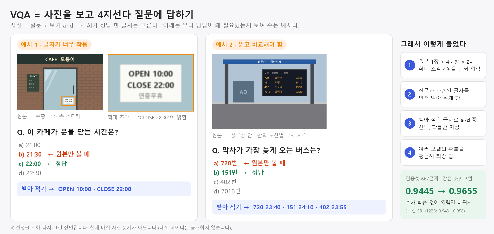
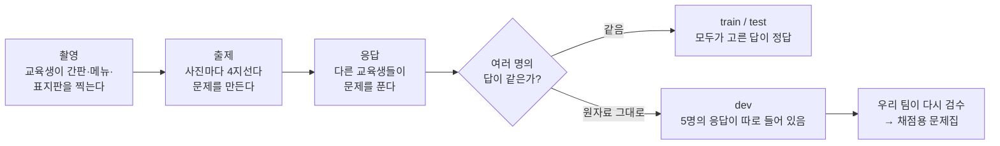
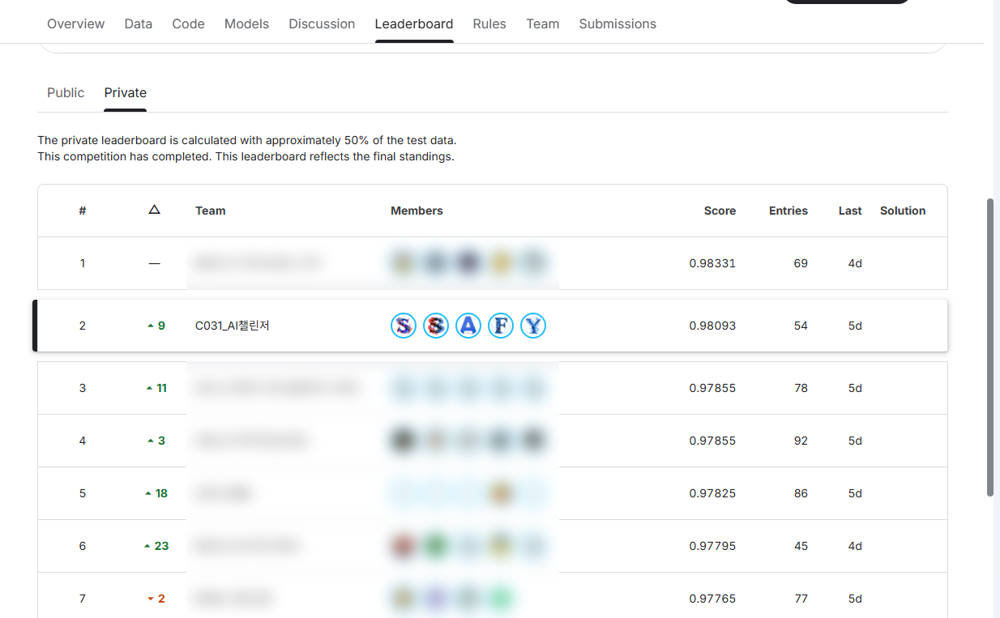
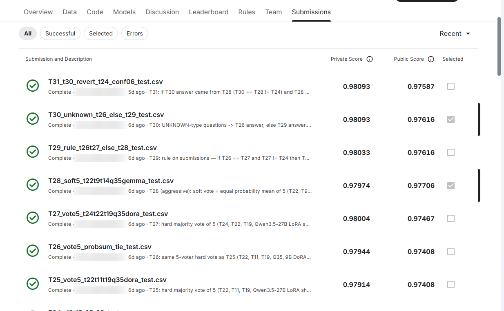

# SSAFY 16기 AI 챌린지 2차 · 사진 속 글자 읽기 VQA

**팀 C031_AI챌린저** · 김진영 · 윤석웅 · 박건순 · 김현호 · 김민우 &nbsp;·&nbsp; 이전 대회: [AI 챌린지 1차 · 재활용품 VQA (954명 중 18위)](https://github.com/Jkim1647/ssafy16-ai-challenge-1)


-0.98093%20·%202위%2F217-FFB000?logo=kaggle&logoColor=white)


> 대회 중(2026-09-26)에 쓰고, 최종 순위(Private)가 공개된 10월 2일에 결과를 채웠습니다. 본문의 Public 순위(8위)는 09-26 기준이고, 마감 때 Public 순위는 11위였습니다.

## 세 줄 요약

- 휴대폰으로 찍은 사진 속 **작은 글자를 읽고 4지선다 문제를 푸는** 대회에 나갔습니다. 217팀 중 **최종 2위(Private 정확도 0.98093)** 를 했습니다. 대회 중 보이던 Public 순위는 11위였는데, 나머지 절반의 문제로 매긴 최종 순위에서 9계단 올랐습니다.
- 이 대회의 데이터는 **교육생들이 직접 사진을 찍고 문제를 낸 것**이고, 우리 팀도 촬영과 출제에 참여했습니다. 대회 중에는 **팀원 5명이 dev 문제 350개를 사진과 하나하나 대조해 다시 라벨링**했고(질문 179개는 새로 씀), 이렇게 만든 채점표가 모든 판단의 기준이 됐습니다. 그 과정에서 "어려운 문제"의 상당수가 사실은 잘못 만들어진 문제라는 것도 알게 됐습니다.
- 점수를 가장 크게 올린 건 더 큰 모델이 아니었습니다. **사진을 잘라서 확대해 보여 주는 방법**과 **서로 다른 모델 여러 개의 답을 모으는 앙상블**이었습니다.

| 첫 제출 | Public 최고 | **최종 (Private)** | 사용한 모델 | 제출 횟수 |
|---|---|---|---|---|
| 0.94221 | 0.97706 | **0.98093 · 2위/217** | 8종 (9B ~ 397B) | 54회 |

---

## 어떤 대회였나

SSAFY 교육생들이 직접 찍은 사진을 가지고, 사진에 대한 객관식 질문에 답하는 AI를 만드는 대회였습니다. 이런 문제를 **VQA**(Visual Question Answering)라고 부릅니다. 사진 한 장과 질문, 보기 a~d를 주면 AI가 정답 한 글자를 고릅니다.



위 그림은 설명을 위해 다시 그린 장면이고 실제 대회 문제는 아닙니다. 하지만 실제로 겪은 두 가지 어려움을 그대로 옮겼습니다. 하나는 글자가 너무 작아 **원본만 보면 틀리는** 문제이고, 다른 하나는 여러 줄을 **읽고 비교해야** 맞히는 문제입니다. 오른쪽 네 단계가 우리가 찾은 풀이이고, 자세한 내용은 아래 「우리가 한 일」에 있습니다.

말로 하면 쉬워 보이지만 실제 사진은 만만하지 않았습니다. 글자가 손톱만 하게 찍혀 있거나, 유리에 빛이 반사되거나, 비스듬히 찍혀 있었습니다. 한글·영어·숫자·일본어가 한 사진에 섞여 있는 경우도 많았습니다. 글자를 읽은 뒤에 "여러 간판 중 어느 것을 묻는 건지" 판단해야 하는 문제도 있었습니다.

| 항목 | 내용 |
|---|---|
| 기간 | 2026.09.21(월) ~ 09.28(월) 09:00. 중간에 추석 연휴(09/24~26)가 있었다 |
| 데이터 | train 6,714장 · dev 2,683장 · test 6,714장 |
| 평가 | 정확도(Accuracy). test의 절반으로 매긴 **Public** 순위는 대회 중에 보이고, 나머지 절반으로 매긴 **Private** 순위가 최종 순위다 |
| 규칙 | 하루 20번 제출, 최종 제출 2개 선택. 공개 모델·외부 데이터는 사용할 수 있지만 **외부 AI API로 답을 받는 것은 금지** |
| 그 밖의 평가 | 재현성, 모델 효율, Discussion 기여, 대회 후 반별 발표 |

주최 측이 기본으로 준 모델은 `Qwen2.5-VL-3B`였습니다. 우리는 공개 모델을 쓸 수 있다는 규칙에 따라 Qwen3.5·3.6·3.8 계열(9B~397B)과 Gemma 4 31B까지 모두 8종을 시험했습니다.

---

## 우리가 한 일

### 1. 데이터를 직접 만들고, 다시 라벨링했다

이 대회 데이터는 외부에서 가져온 게 아니라 **교육생들이 "데이터 수집 미션"으로 직접 만든 것**입니다. 우리 팀도 사진을 찍고 문제를 냈습니다. 만들어진 과정은 이렇습니다.



여기서 중요한 사실을 하나 알게 됐습니다. **정답은 "사진에 적힌 진짜 답"이 아니라 "사람들이 합의한 답"입니다.** 여러 교육생이 똑같이 고른 문제만 train과 test에 들어갔습니다. 반면 dev에는 걸러지지 않은 원자료가 그대로 있었습니다. dev 2,683문제 중 1,868문제는 5명 중 3명만 같은 답을 골랐을 정도로 의견이 갈렸습니다.

데이터를 정리하면서 한 일은 다음과 같습니다.

- **중복 사진 찾기**: 같은 사진이 train과 test에 동시에 들어 있으면 모델이 답을 "외워서" 맞히게 되어 점수가 부풀려집니다. 파일이 완전히 같은 경우와, 다시 저장돼 조금 달라진 경우를 모두 찾아서 **45묶음**을 발견했고 검증에서 떼어 냈습니다.
- **옆으로 누운 사진 바로잡기**: 휴대폰 사진의 회전 정보가 무시되는 버그를 고쳤습니다.
- **잘못 만든 문제 빼기**: 보기가 중복됐거나, 글자가 깨졌거나, 정답이 보기에 없는 문제 **71개**를 학습에서 뺐습니다.
- **dev 다시 채점하기**: dev 문제를 모델과 사람이 함께 다시 봤습니다. 팀원들이 350문제를 나눠 사진과 하나하나 대조했고, 틀린 질문 179개는 고쳐 썼습니다. 이렇게 만든 게 뒤에 나오는 채점용 문제집 **H408 v2(401문제)** 입니다.

검수를 해 보니 놀라운 게 있었습니다. 모델들이 계속 틀리던 "어려운 문제" 139개를 사람이 확인했더니, **절반은 질문이나 보기 자체가 잘못돼 있었고 23%는 사람이 봐도 답을 정할 수 없었습니다.** 이걸 정리하고 나니 "모든 모델이 틀리는 문제"가 33개에서 5개로 줄었습니다.

### 2. 믿을 수 있는 채점표를 만들었다

대회 중에 보이는 Public 점수는 test의 절반만으로 매긴 점수입니다. 1차 대회 때 우리는 Public 점수만 보고 모델을 고르다가 실제 순위에서 손해를 본 적이 있습니다. 그래서 이번에는 **"Public이 아니라 우리가 만든 문제집으로 채택을 결정한다"** 를 원칙으로 삼았습니다.

처음에는 dev를 그대로 채점용으로 쓰려고 했습니다. 그런데 앞에서 말했듯 dev는 의견이 갈린 문제가 몰려 있어서 test와 성격이 다릅니다. 그래서 채점표를 세 개로 나눴습니다.

| 채점표 | 어디서 왔나 | 문제 수 | 무엇을 보나 |
|---|---|---|---|
| **val667** | train에서 떼어 놓고 학습에는 절대 쓰지 않은 문제 | 667 | 학습시킨 모델끼리 비교 |
| **train 전체** | 학습하지 않은 모델에게는 train 전체가 test와 같은 방식으로 만든 문제집이다 | 6,047 | test와 가장 비슷한 조건의 점수 |
| **H408 v2** | dev를 사람이 다시 검수해 만든 어려운 문제 모음 | 401 | 작은 글씨, 여러 단서를 합쳐야 하는 문제 |

새로운 방법은 **train 쪽 점수가 오르고, H408 v2 점수가 떨어지지 않을 때만** 채택했습니다. 두 채점표를 모두 통과해야 하는 셈입니다.

이 방식이 실제로 도움이 됐습니다. 한 제출(T13)은 H408 v2에서 기존 최고와 동점이었는데, Public에서는 10문제나 떨어졌습니다. 그때부터 H408 v2에서 "비기는" 정도의 후보는 기대하지 않게 됐습니다. 반대로 val667에서 1등이던 27B 모델이 Public에서는 3등으로 밀린 적도 있어서, 채점표 하나만 믿으면 안 된다는 것도 배웠습니다.

> **잡음은 얼마나 될까?** Public은 약 3,357문제라서 1문제를 더 맞히면 점수가 0.0003 오릅니다. 두 제출의 답이 K개 다르면, 우연만으로도 약 √(K/2)문제 정도 차이가 날 수 있습니다. 예를 들어 답이 18개 다른 두 제출이 Public에서 2~3문제 차이 나는 건 "좋아졌다"는 증거가 되지 못합니다. 우리는 이 기준보다 작은 차이는 무시했습니다.

### 3. 모델을 키우기보다 사진을 잘 보여 줬다

처음에는 모델이 클수록 잘 맞힐 거라고 생각했습니다. 그런데 틀린 문제를 모아 보니 가장 많은 원인이 **"글자가 너무 작아서 못 읽음"** 이었습니다. 모델을 9B → 35B → 122B로 키워도 val667 정확도는 0.943 → 0.9445 → 0.958로 조금씩만 올랐습니다.

그래서 방향을 바꿨습니다.

1. **사진을 잘라서 확대해 보여 준다** — 원본 사진 한 장에 더해, 사진을 네 조각으로 나눠 두 배로 키운 조각 4장을 함께 넣었습니다(아래 표의 `tiles2x2`).
2. **읽고 나서 고르게 한다** — 먼저 "질문과 관련된 글자를 그대로 받아 적어라"라고 시키고(`read`), 그다음에 보기 a~d 중 하나를 고르게 했습니다.

이 두 가지만으로 35B 모델이 추가 학습 없이 **0.9445 → 0.9655**로 올랐습니다. 모델을 세 배 넘게 키운 것보다 큰 효과였습니다.

사진 전체를 AI로 선명하게 키우는 "초해상도" 방식은 일부러 쓰지 않았습니다. 흐린 "8"을 선명한 "3"으로 바꿔 버리는 식의 잘못된 복원이 일어날 수 있기 때문입니다. 정답이 글자인 문제에서는 치명적입니다.

답을 고를 때는 모델에게 답을 글로 쓰게 하지 않았습니다. 대신 **a·b·c·d 네 글자 각각에 모델이 매기는 확률**을 받아서 가장 높은 것을 골랐습니다. 이렇게 하면 형식 오류가 생기지 않고, 저장해 둔 확률로 나중에 앙상블을 몇 번이든 다시 계산할 수 있습니다.

```python
# 모델이 다음에 올 글자로 a, b, c, d 중 무엇을 가장 그럴듯하게 보는지만 본다
logits = model(**inputs).logits[:, -1, choice_token_ids]   # a, b, c, d
pred = "abcd"[logits.argmax(-1)]
```

### 4. 여러 모델의 의견을 모았다 (앙상블)

모델마다 틀리는 문제가 달랐습니다. 그래서 여러 모델의 a~d 확률을 평균 내서 답을 정했습니다. 사람으로 치면 여러 명에게 물어보고 다수 의견을 따르는 셈입니다.

처음 효과를 확인한 건 35B와 397B 두 모델을 섞었을 때였습니다. train 전체(6,047문제)에서 각자 5,836문제를 맞혔는데, 섞으니 5,869문제를 맞혔습니다. 우연으로 보기 어려운 차이(+0.55%p)가 처음으로 나온 순간이었습니다.

그다음부터는 **"잘하는 모델"보다 "다르게 틀리는 모델"** 을 찾았습니다.

- 같은 모델에 질문만 바꿔 던진 변형은 틀리는 문제가 94%나 겹쳐서 도움이 안 됐습니다.
- 비슷한 27B 모델 두 개도 틀리는 문제가 많이 겹쳐서 하나만 남겼습니다.
- Qwen이 아닌 **Gemma 4**는 틀리는 패턴이 달라서 앙상블에 도움이 됐습니다.
- 다른 참가자가 Discussion에 공유한 **"학습할 때 보기 순서를 섞어라"** 는 아이디어를 Qwen3.5-27B에 적용했습니다. 이 모델(Q35)은 val667에서 가장 높은 점수(667문제 중 650문제)를 냈습니다.

섞는 방법도 기하평균, 가중평균, 따로 학습한 결합기 등 8가지를 비교했습니다. 뚜렷하게 이긴 방법이 없어서, 조정할 게 가장 적은 **단순 확률 평균**을 기본으로 썼습니다. 가중치를 세밀하게 맞출수록 채점표에만 과하게 맞춰질 위험이 커지기 때문입니다.

#### 최종 제출 두 개

| | T28 (공격형) | T30 (보정형) |
|---|---|---|
| 만든 방법 | 앞서 만든 좋은 조합 3개 + Q35 + Gemma를 똑같은 비중으로 평균 | T28을 바탕으로, 다수결 제출들이 한목소리로 다른 답을 낸 문제는 다수결을 따름 |
| Public | **0.97706** (팀 최고) | 0.97616 |
| H408 v2 (401문제) | 377 | 377 |
| **Private (최종)** | 0.97974 | **0.98093 → 최종 점수, 2위** |

- **T28을 고른 이유** — 지금까지의 좋은 조합들이 각자 조금씩 다른 정보(추가 모델, 보기 순서를 돌려서 다시 묻기 등)를 담고 있었습니다. 이걸 똑같은 비중으로 섞으면 정보는 모두 들어가면서 어느 하나가 결과를 휘두르지 않습니다. Public에서 기준 제출(T6)보다 9문제를 더 맞혔고, 이는 잡음 폭(약 ±4.7문제)의 두 배 정도입니다.
- **T30을 고른 이유** — 확률 평균은 지나치게 자신만만한 모델 하나에 끌려갈 수 있습니다(실제로 397B가 가장 그랬습니다). 그래서 여러 방식의 다수결이 같은 답을 가리키는 곳은 그쪽을 따르게 했습니다. T28과는 9문제만 다릅니다.
- **솔직한 한계** — T28과 T30은 거의 같은 제출입니다(6,714문제 중 6,705문제가 같은 답). 둘 다 Public 점수를 보면서 다듬은 제출이라, 만약 Public에 과하게 맞춰졌다면 둘이 함께 손해를 봅니다. 우리 채점표 기준으로는 오히려 T6(H408 v2 381점)이 더 좋았습니다. 어느 쪽이 옳았는지는 Private 점수가 나오면 확인할 수 있습니다.
- **결과 (10/02)** — Public을 보며 고른 쪽이 맞았습니다. Private에서 T30 0.98093, T28 0.97974, T6 0.97855로, 두 제출 모두 T6보다 높았습니다(T30은 약 8문제 차이). 두 제출이 다른 9문제 중 Private에 들어간 문제에서는 T30이 약 4문제를 더 맞혔고, Public에 들어간 문제에서는 T28이 약 3문제를 더 맞혔습니다. 자세한 비교는 아래 「최종 결과」에 있습니다.

---

## 결과

### 최종 결과 (Private, 10/02)

**217팀 중 2위, 정확도 0.98093.** 1위(0.98331)와는 약 8문제, 3위(0.97855)와는 약 8문제 차이입니다. Private은 test의 절반(약 3,357문제)으로 매기므로 0.0003이 1문제입니다.

| 제출 | 무엇인가 | 우리 채점표 (H408 v2) | Public | **Private** |
|---|---|---|---|---|
| **T30** ✅ | T28 + 다수결 보정 | 377 | 0.97616 | **0.98093** |
| T31 | T30에서 3문제를 T24 답으로 되돌림 (선택 안 함) | 377 | 0.97587 | 0.98093 |
| T29 | T30에서 유형 보정 전 | 376 | 0.97616 | 0.98033 |
| T27 | 5개 다수결 | 378 | 0.97467 | 0.98004 |
| **T28** ✅ | 5개 확률 균등 평균 | 377 | **0.97706** | 0.97974 |
| T24 | T18·T15 가중 평균 | 380 | 0.97497 | 0.97914 |
| T6 | 4개 확률 평균 (채점표 최고) | **381** | 0.97438 | 0.97855 |
| 397B 단독 | 가장 큰 모델 하나 | – | 0.96693 | 0.96961 |

- **Public을 보고 고른 판단이 결과적으로 맞았습니다.** 마지막 날 T28에 다수결 보정을 얹은 T29~T31이 우리 제출 중 Private 1~3위였습니다. 반대로 우리 채점표에서 가장 높았던 T6는 T30보다 약 8문제 낮았습니다. 401문제짜리 채점표로는 이 정도 차이를 가려낼 수 없었습니다.
- **Public 1등 제출이 Private 1등은 아니었습니다.** T28은 Public 최고였지만 Private에서는 다수결로 보정한 T29·T30보다 낮았습니다. 하나의 Public 점수로 고르기보다 비슷한 후보 둘을 함께 고른 덕을 봤습니다.
- **어떤 제출을 골랐어도 1위에는 닿지 않았습니다.** 우리가 낸 54개 제출 중 Private 최고가 0.98093입니다.
- 제출 전체의 Private 점수는 [reports/kaggle_private_scores_20261002.tsv](reports/kaggle_private_scores_20261002.tsv)에 있습니다.

### Public 점수가 오른 과정


| 날짜 | 무슨 일이 있었나 | Public |
|---|---|---|
| 09/21 | 데이터 정리, 채점표(val667) 고정, 첫 제출(9B)과 첫 앙상블(9B+35B) | 0.94221 → 0.95621 |
| 09/22 | 사진 확대·받아 적기 방식 발견, 397B 투입, 35B+397B 앙상블 | 0.96931 |
| 09/23 | 채점표 신뢰도 점검, 잘못 만든 문제 정리, 27B·Gemma 학습 | 0.97348 (7위) |
| 09/24 | 섞는 방법을 확률 평균으로 변경, H408 v2 완성 | 0.97438 |
| 09/25 | 보기 순서를 섞어 학습한 Q35 추가 | 0.97497 |
| 09/26 | 여러 조합을 다시 섞은 T28, 다수결로 보정한 T30 → 최종 선택 | **0.97706 (8위)** |
| 09/28 | 마감 | 0.97706 (11위) |
| 10/02 | Private 공개 — 최종 점수는 T30 | **Private 0.98093 (2위)** |

### 모델별 성적

`val667`은 667문제 중 맞힌 수 또는 정확도, `H408 v2`는 401문제 중 맞힌 수입니다. `제로샷`은 추가 학습 없이 그대로 쓴 것, `LoRA`는 대회 데이터로 가볍게 추가 학습한 것입니다.

| 모델 | 방식 | 입력 | val667 | H408 v2 | Public | 한 줄 평 |
|---|---|---|---|---|---|---|
| Qwen3.5-9B | 제로샷 | 원본 | 0.9430 | – | 0.94221 | 첫 제출 |
| Qwen3.5-9B | LoRA | 원본 | 640 | 320 | – | 작은 모델의 한계 |
| Qwen3.6-27B | LoRA | 원본 | 646 | 341 | 0.96187 | val667 1등이었지만 Public은 3등 |
| **Qwen3.6-27B (R3)** | LoRA | 확대 | 646 | 363 | – | 앙상블 주력 |
| **Qwen3.5-27B (Q35)** | LoRA + 보기 섞기 | 확대 | **650** | 363 | – | 단독 최고 |
| Qwen3.6-35B-A3B | 제로샷 | 확대+받아 적기 | 644 | 363 | 0.96455 | 입력만 바꿔 +2.1%p |
| Qwen3.5-122B-A10B | 제로샷 | 확대+받아 적기 | 0.9580 | – | – | 35B보다 나은 게 없어 보류 |
| **Qwen3.5-397B-A17B** | 제로샷 | 확대+받아 적기 | 643 | 368 | 0.96693 | 단독 제출 중 Public 최고 |
| **Gemma 4 31B-it** | LoRA | 확대 | 647 | 366 | – | 다른 계열이라 앙상블에 도움 |
| Qwen3.8-27B | 제로샷 | 확대+받아 적기 | 636 | 357 | – | 채택 안 함 |

### 앙상블이 이어진 모습


왼쪽 점은 모델 하나하나의 예측이고, 오른쪽 점은 제출 순서입니다. 곡선은 "이 제출에 이 모델(또는 이전 제출)이 들어갔다"는 뜻이고, 색은 모델 계열입니다. 진하게 칠한 선을 따라가면 최종 제출 T28·T30이 어떤 모델들로 만들어졌는지 볼 수 있습니다. 두 제출 모두 모델 예측 18개 중 9개를 담고 있습니다. 아래 막대는 제출별 Public 점수입니다.

<details>
<summary><b>주요 제출 목록 펼치기</b></summary>

| 제출 | 구성 | Public | H408 v2 |
|---|---|---|---|
| 35B+397B | 두 모델 확률을 반반 섞음 | 0.96931 | – |
| T1 | 5개 모델 평균 (27B·35B·397B·9B·Gemma) | 0.97170 | – |
| T4 | 9B를 빼고 4개 모델 (R3·35B·397B·Gemma) | 0.97348 | 381 |
| T6 | T4와 같은 4개 모델, 섞는 방법을 확률 평균으로 | 0.97438 | 381 |
| T18 | T6 + Q35 | 0.97497 | – |
| T27 | 5개 제출의 다수결 | 0.97467 | 378 |
| **T28** ✅ | 좋은 조합 3개 + Q35 + Gemma 균등 평균 | **0.97706** | 377 |
| T29 | 다수결 두 개가 같은 답이면 그 답, 아니면 T28 | 0.97616 | 376 |
| **T30** ✅ | T29 + 유형을 알 수 없는 문제는 다수결 답 | 0.97616 | 377 |

✅ = 최종 제출로 고른 것. T1~T16 전체 비교는 [reports/all_submissions_20260924.md](reports/all_submissions_20260924.md)에 있습니다.

</details>

<details>
<summary><b>해 봤지만 효과가 없었던 것 펼치기</b></summary>

| 시도 | 결과 |
|---|---|
| 397B의 지식을 9B에 옮기기 (지식 증류) | val667 0.9625 → 0.9565, 오히려 떨어짐 |
| 35B 전체 파라미터 학습 (GPU 메모리 138GB) | 어려운 문제에서 LoRA보다 낮음 (0.7221 vs 0.7553) |
| 4비트로 압축한 채 학습 (QLoRA) | 어려운 문제에서 7.4%p 떨어짐 |
| LoRA 대신 DoRA (9B) | 조금 더 나쁨 (638/309 vs 640/320) |
| 35B(MoE) vs 27B(일반 구조) LoRA | 633 vs 646 — 같은 조건이면 27B가 나았고 4번 반복해도 같았다 |
| 생각하는 모드, 확률 보정, 숫자 검증기, 모델 빼 보기, 문제 유형별 라우팅, 해상도 바꾸기, 보기 순서 돌리기 | 모두 기존 최고(T6)와 같거나 잡음 수준 |
| Qwen3.8-27B 추가 | Public +1문제, 우리 채점표에서는 −2 → 채택 안 함 |

</details>

---

## 배운 것

**잘한 점**

- 우리 손으로 만든 데이터라서 "정답은 사람들의 합의"라는 구조를 금방 이해할 수 있었고, 중복·결함·dev의 성격 차이를 모델을 돌리기 전에 찾아냈습니다.
- 채점표를 직접 만들고 계속 고친 덕분에, Public에서 우연히 오른 후보를 여러 번 걸러냈습니다.
- 가장 큰 개선은 더 큰 모델이 아니라 사진을 잘라서 보여 주는 방법에서 나왔습니다.
- 모든 모델의 a~d 확률을 저장해 둬서, 모델 16개·제출 32개 조합을 GPU 없이 다시 계산할 수 있었습니다.
- 틀린 결론도 바로잡았습니다. 한때 "학습시킨 모델은 질문 표현이 바뀌면 무너진다"고 적었지만, 알고 보니 우리 데이터를 만들 때 생긴 실수였습니다.

**아쉬운 점**

- 마지막 날에는 결국 Public 점수에 기댔습니다. 최종 두 제출은 우리 채점표에서 T6보다 4문제 낮았는데, Private에서는 오히려 T6보다 높았습니다(T30 +8문제). 결과는 좋았지만, 거꾸로 말하면 우리가 공들인 채점표가 마지막 몇 문제 차이는 구별하지 못했다는 뜻입니다.
- 라벨을 "사진상 엄밀한 정답"으로 고쳤더니 오히려 채점 기준에서 멀어졌습니다. 검수자가 고친 문제는 원래 라벨러들의 다수 의견과 일치하는 비율이 81%에서 43~48%로 떨어졌습니다. 라벨링할 때는 "무엇이 맞는가"보다 "무엇으로 채점하는가"를 먼저 봐야 했습니다.
- 유료 GPU 운영에서 실수가 있었습니다. 저장공간 없이 띄운 서버, 환경이 안 맞는 설치, 실패한 작업이 3시간 동안 서버를 붙잡아 약 $14가 나갔습니다.
- 작업 기록이 여기저기 흩어져, 마지막 이틀은 커밋 메시지에만 남았습니다.

---

## 용어 풀이

| 용어 | 뜻 |
|---|---|
| VQA | Visual Question Answering. 사진을 보고 질문에 답하는 문제 |
| VLM | 사진과 글을 함께 이해하는 AI 모델 (Vision-Language Model) |
| 9B, 397B | 모델 크기(파라미터 수). 9B는 90억 개, 397B는 3,970억 개 |
| MoE | 여러 전문가 중 일부만 골라 쓰는 모델 구조. 35B-A3B는 350억 개 중 30억 개씩만 쓴다 |
| 제로샷 | 대회 데이터로 추가 학습하지 않고 그대로 쓰는 것 |
| LoRA / DoRA | 모델 전체가 아니라 작은 부품만 추가로 학습시키는 방법. 적은 GPU로도 가능하다 |
| 앙상블 | 여러 모델의 답을 모아 최종 답을 정하는 것 |
| Public / Private | 대회 중 보이는 점수(test 절반) / 최종 순위를 정하는 점수(나머지 절반) |
| 과적합 | 특정 채점표에만 너무 맞춰져서 새로운 문제에서는 오히려 못하는 상태 |
| val667, H408 v2 | 우리가 만든 채점용 문제집. 각각 667문제, 401문제 |
| 누수 | 채점용 문제가 학습 데이터에 섞여 점수가 부풀려지는 것 |

---

## 대회 기록 (Kaggle 화면)

**Private 리더보드 (최종, 10/02)** — 2위 (0.98093)



**최종 제출 두 개의 Private 점수** — T30 0.98093, T28 0.97974 (오른쪽 체크가 최종 선택)



아래는 마감 이틀 전(09-26)에 찍은 화면입니다.
다른 팀 이름과 제출자 계정은 흐리게 가렸습니다.

**대회 개요** — 217팀, 991명이 참가해 5,484번 제출했습니다.


**Public 리더보드 (09-26)** — 8위 (0.97706, 53번 제출). 마감 때는 11위


**최종 제출 선택** — T30과 T28


<details>
<summary><b>제출 기록 더 보기 (T11 ~ T27)</b> — 제출할 때마다 구성과 채점표 점수를 설명에 적어 두었습니다</summary>


</details>

---

## 코드 둘러보기

### 폴더 구조

```text
├─ src/            처음 설계한 실험 파이프라인 (python -m src.run). 대회 첫날 9B 실험에 사용
├─ tools/          실제 대회에서 쓴 도구들
│  ├─ colab_35b_infer.py      모델 추론 (사진 확대·받아 적기 옵션 포함)
│  ├─ colab_vllm_infer.py     큰 모델을 빠르게 돌리는 추론 (vLLM)
│  ├─ colab_lora_train.py     LoRA / DoRA 학습
│  ├─ ensemble_submit.py      여러 모델의 확률을 섞어 제출 파일 만들기
│  ├─ score_dual_gate.py      두 채점표로 후보 평가
│  ├─ export_test_confidence_csv.py   최종 제출(T22~T30)을 만든 결합식
│  └─ plot_ensemble_lineage.py        위의 앙상블 그림 생성
├─ configs/        모델·GPU·실험 설정
├─ data_meta/      학습/검증 분할, 제외한 문제 목록 (문제 번호만 있음)
├─ data_preparation/   dev 검수 도구와 절차 문서
├─ reports/        실험 보고서와 그림
└─ tests/          인코딩·결함 검사 규칙 테스트
```

> 대회 사진과 문제, 그리고 문제별 예측·분석표·제출 파일은 이 저장소에 없습니다. 대회 규칙과 사진을 찍은 교육생들의 개인정보를 지키기 위해서입니다. 보고서에도 집계 결과만 남기고, 문제 하나하나를 설명한 부분은 뺐습니다.

### 실행해 보기

```bash
python -m venv baseline && baseline\Scripts\activate   # Windows 가상환경
pip install -e .                                        # 의존성 설치 (transformers는 특정 커밋으로 고정, SETUP_QWEN35.md 참고)
python -m unittest discover -s tests                    # 테스트
```

대회 데이터는 SSAFY 교육생 전용이라 이 저장소에 없습니다. 대회 참가자라면 배포받은 `ssafy-16-2-ai.zip`을 저장소 루트에 풀면 됩니다.
Docker를 쓰려면 `docker compose up --build -d`로 띄웁니다.

**모델 하나로 예측하기** — 사진 확대(`tiles2x2`)와 받아 적기(`read`)를 켠 35B 모델:

```bash
python tools/colab_35b_infer.py --data ssafy-16-2-ai --split test \
    --model Qwen/Qwen3.6-35B-A3B --prompt read --view tiles2x2 --out shared_predictions/<run>/
```

**두 모델 섞어서 제출 파일 만들기** — Public 0.96931을 받은 35B+397B 조합:
(예측 파일은 대회 데이터에서 나온 것이라 공개 저장소에는 없습니다. 명령 형식만 참고해 주세요.)

```bash
python tools/ensemble_submit.py out.csv \
    shared_predictions/colab_ai2_35b_out/Qwen3.6-35B-A3B_read_test_tiles2x2x2_predictions.jsonl \
    shared_predictions/nebius_397b_test/Qwen3.5-397B-A17B-FP8_read_test_tiles2x2x2_vllm_predictions.jsonl \
    --weights 0.5,0.5 --logprob
```

**채점표로 평가하기**:

```bash
python tools/score_dual_gate.py --cand <predictions.jsonl>   # train 전체 + H408 v2로 평가
```

`tools/runpod/`, `tools/nebius/`의 스크립트는 유료 GPU 서버를 띄우므로 비용이 듭니다.

### 사용한 장비

Colab Pro+ (RTX PRO 6000 96GB), RunPod (H200, RTX PRO 6000), Nebius (H100 8장, 397B 모델용), 팀원 PC의 RTX 5060 Ti 5대.

---

## 팀

| 이름 | 사전 조사 담당 | 대회 중 맡은 일 |
|---|---|---|
| 김진영 | Qwen3.6-35B-A3B | 실험 설계, 채점표·dev 검수, 학습, Gemma 앙상블, 앙상블·제출 |
| 윤석웅 | Qwen3.5-397B-A17B | 전략 문서, 최신 논문 조사, 서버·비용 관리 인프라(RunPod·MLflow·Jetson), 35B 프롬프트 |
| 김민우 | Qwen3.5-122B-A10B | 122B 운용 조사, dev 라벨 검토, 중간 발표 PPT 발표 |
| 김현호 | Qwen3.5-9B / 2B | 작은 모델 운용 조사, dev 라벨 검토, 중간 발표 PPT 제작 |
| 박건순 | Qwen3.5-9B / 2B | 작은 모델 운용 조사, dev 라벨 검토 |

**더 읽을거리**

- [reports/](reports/) — 실험 보고서. 채점표 신뢰도 점검(`eval_reliability_20260923.md`), 라벨 재검수(`gold_v4_rescore_20260923.md`), 앙상블 비교(`h408_ensemble_20260924.md`) 등
- [data_preparation/dev_relabel/README.md](data_preparation/dev_relabel/README.md) — dev 문제를 다시 쓰고 5명이 나눠 검수한 절차

---

## 라이선스

- **코드와 문서**: [MIT License](LICENSE) © 2026 C031_AI챌린저
- **대회 데이터**: SSAFY 교육생이 찍고 만든 비공개 대회 데이터로, 권리는 주최 측과 촬영자에게 있습니다. 이 저장소에 포함하지 않으며 MIT 라이선스 대상도 아닙니다.
- **사용한 모델**: 가중치는 포함하지 않았고, 각 모델의 라이선스를 따릅니다. 사용한 Qwen3.5·3.6·3.8 계열과 Gemma 4 31B-it은 모두 Apache-2.0입니다(Hugging Face 모델 정보 기준, 2026-09-26 확인).

